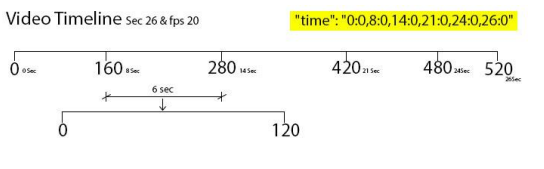
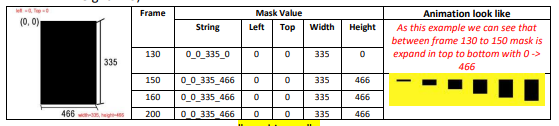
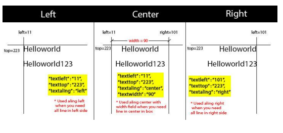
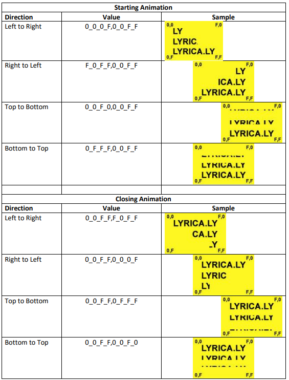

# LYSON
**Lyrical.ly  Script Object Notation** `VERSION 8.0`


## Index
- [CommonNotation](#common-notation)
- [MultiMaskInputs & HiddenMaskInputs & MaskInputs](#multimaskinputs--hiddenmaskinputs--maskinputs)
- [TextInputs](#textinputs)
- [TextEffects](#texteffects)
- [MaskSetting](#masksettings)
- [TextSetting](#textsettings)
- [Sample LYSON](#sample-lyson)

## Common Notation

```
{
	"width": "720",
	"height": "1280",
	"fps": "20",
	"type": "none",
	"time": "0:0,15:0",
	"length": "15",
	"logoplace": "TR",
	"islogoblack": "false",
	"isexternalaudioallow": "true",
	"audiotitle": "Dil Se Bandhi Ek Dor",
	"backgroundvideo" : "background.mp4"
}
```

- **~~type:~~** *type is always none in lyson 7.0+*

  `"type": "none"`

- **width:** *output video width `Default: 720`*

  `"width": "1080"`

- **height:** *output video height `Default: 1280`*

  `"height": "1080"`

- **fps:** *output video fps(frame per second) `Default: 20`*

  `"fps": "30"`

- **nophoto:** *nophoto is max number of multiple photo need to selected*

  `"nophoto": "6"`

- **time:** *time mention timeline for effect and animation draw in canvas*
  
  `"time": "0:0,4:2,8:0,12:0,16:0,20:18,26:0"`
  

- **length:** *The length of the output video is defined by this value. `In second`*
  
  `"length": "26"`

- **logoplace:** *The logoplace specifies where the logo will be displayed `Default: TR`*
  
  `"logoplace": "TR"`

  | Code | Position |  
  -------|------------  
  | TR | Top, Right|  
  | BR | Bottom, Right|  
  | TL | Top, Left|  
  | BL | Bottom, Left|  
  | CC | Center |

- **logoalpha:** *The logoalpha value defines the logo's transparency. Range is 0 - 255 `Default: 255`*

  `"logoalpha": "255"`

- **islogoblack:** *The logo will be displayed in black if islogoblack is true, otherwise it will be displayed in white `Default: 255`*

  `"islogoblack": "false"`


- **videobitrate:** *The videobitrate determines the video output bitrate `Default: 2M`*

  `"videobitrate": "2M"`

- **backgroundvideo:** *Background video*

  `"backgroundvideo" : "background.mp4"`

- **crf:** *The value is used to compress the output video, the higher the value, the more compressed the video `Default: 30`*

  `"crf": "27"`

- **isexternalaudioallow:** *When isexternalaudioallow is true, the user can select audio from the SD card `Default: False`*

  `"isexternalaudioallow" : "true"`


- **audiotitle:** *Audio Title  `Default: Background Music`*

  `"audiotitle" : "Hey re meri moto"`
  
  - **selecetbyinput()**: *This eq is used when the audiotitle depends on the previous input, expression is join with (#) text1 join
    with (#) audio title list, It means title is selected from list by text1 input id*
    
  `"audiotitle" : "selecetbyinput()#text1#AudioM:AudioA:AudioY"`

- **audiofile:** *audiofile is name of audio file  `Default: audio.mp3`*

  `"audiofile": "y_audio.mp3"`

  - **selecetbyinput()**: *This eq is used when the audiofile depends on the previous input, expression is join with (#) text1 join
    with (#) audio file list, It means audio file is selected from list by text1 input id*

  `"audiofile": "selecetbyinput()#text1#m_audio.mp3:a_audio.mp3:y_audio.mp3"` 

- **aimodel:** *AI Models*

  `"aimodel": ["face278","facemask","disney","comic"]`

   #### aimodel with effect
  | Effect | Need of Model |  
    -------|------------  
  | Face Key Point  | "face278" |  
  | Face Mask | "face278","facemask" |  
  | disney | "face278","facemask","disney" |  
  | removebg | - |  
  | skyseg | "skyseg" |
  | clothesseg | "clothesseg" |
  | hairseg | "hairseg" |
  | headseg | "face278","headseg" |
  | comic | "comic" |
  | cartoon | "cartoon" |


## MultiMaskInputs & HiddenMaskInputs & MaskInputs

```
"multimaskinputs": [{
    "srno": "1",
    "maskid": "mask1",
    "maskimg": "mask1.png",
    "maskover": "over.png"
}, {
    "maskid": "mask2",
    "maskratiosize": "720,1280",
    "maskratio": "1:2",
    "maskover": "over.png"
}, {
    "maskid": "mask3",
    "masksize": "720,1280",
    "maskover": "over.png"
}]
```

```
"hiddenmaskinputs": [{
    "maskid": "hmask1",
    "maskimg": "mask1.png",
    "maskover": "over.png",
    "photoeq": "getMaskPhoto()#mask1"
}, {
    "maskid": "hmask2",
    "maskimg": "mask2.png",
    "maskover": "over.png",
    "photoid": "2",
    "isgray": "false",
    "isblur": "false",
    "photoeffect": "multiply",
    "photoname": "addoverlay1.png"
}]
```

```
"maskinputs": [{
    "srno": "1",
    "maskid": "fmask1",
    "maskimg": "mask1.png",
    "maskover": "over.png",
    "hs_bgremove": "true",
    "hs_bgremovetype": "face"
}, {
    "srno": "2",
    "maskid": "fmask1",
    "maskimg": "mask1.png",
    "maskover": "over.png",
    "hs_bgremove": "true",
    "hs_bgremovetype": "full",
    "isgray": "false",
    "isblur": "false",
    "photoeffect": "multiply",
    "photoname": "addoverlay1.png"
}]
```

- **srno:** *The srno is the order number in this list, and the srno represents the input position to ask the user*

  `"srno" : "1"`

- **maskid:** *maskid is unique id in all inputs, maskid is used to get this user image*

  `"maskid": "mask1"`

- **maskimg:** *This is mask to reshape photo selected by user*

  `"maskimg": "page1_mask1.png"`

  - **selecetbyinput()** *eq is used to get mask image from previous text input, here selecetbyinput() join with (#) text1 join with (#) mask image list, It means image is selected from list base on text1 input*

    `"maskimg": "selecetbyinput()#text1#m_mask.png:a_mask.png:y_mask.png"`

- **maskover:** *maskover is a frame image that is overlaid above a user selected photo*

  `"maskover": "page1_frame1.png"`

  - **selecetbyinput()** *eq is used to get overlay image from previous text input, here selecetbyinput() join with (#) text1 join with (#) over image list, It means image is selected from list base on text1 input*

    `"maskover": "selecetbyinput()#text1#m_frame.png:a_frame.png:y_frame.png"`

- **maskhintover:** *maskhintover is a frame image that is overlaid help for user to crop photo*

  `"maskhintover": "help_frame1.png"`

- **photoid:** *This is id for pre-selected image from list previously get from multi photo selection.*

  `"photoid" :"1"`

- **photourl:** *Select photo direct from template asset folder.*

  `"photourl" :"sample_image.jpg"`

- **photoeq:** *photoeq is used to select user photo from other maskid. `Used in HiddenMaskInputs`*

  `"photoeq": "getMaskPhoto()#mask1"`

- **isskip:** *When the isskip value is true, this input is not required. `Default: false`*

  `"isskip": "true"`

- **isblur:** *If isblur is true, blur effect apply on user selected photo. `Default: false`*

  `"isblur": "true"`

- **isgray:** *If isgray is true, gray effect apply on user selected photo. `Default: false`*

  `"isgray": "true"`

- **photoeffect** *is effect name, define in table. `Default: false`*

  `"photoeffect": "addoverlay"`

- **photoname** *is image or color apply on photo with selected photoeffect. `Must be used with photoeffect`*

  `"photoname": "addoverlay1.png"`

   ##### photoeffect & photoname combination table
  
    | photoeffect | photoname | notes |
    |------------ | --------- | ----- |
    | addoverlay | ImageName | Overlay photo and image |
    | darken | ImageName | Image and photo with darken effect |
    | lighten | ImageName | Image and photo with lighten effect |
    | multiply | ImageName | Image and photo with multiply effect |
    | add | ImageName | Image and photo with add effect |
    | overlay | ImageName | Image and photo with overlay effect |
    | screen | ImageName | Image and photo with screen effect |
    | blur | - | Photo with blur effect |
    | gray | - | Photo with gray effect |
    | color | orange, sky, red, yellow, cyan, blue, gray | Any one color you select for color effect with photo |

- **hs_bgremove:** *When the user's background needs to be removed, hs_bgremove is true. `Default: false` `use in MaskInputs`*

  `"hs_bgremove": "true"`

- **hs_bgremovetype:** *hs_bgremovetype value is either face or full. `Default: face` `use in MaskInputs`*

  `"hs_bgremovetype": "full"`

## TextInputs

```
"textinputs": [{
    "srno": "1",
    "textid": "text1Name",
    "textkey": "XXX",
    "textlable": "Fiance Name",
    "textsample": "AADITYA",
    "textmaxchar": "7",
    "textCase" : "upper"
},{
    "srno": "2",
    "textid": "text2Date",
    "textkey": "DDD",
    "textlable": "Wedding Date",
    "textinputcontrol": "date",
    "textsampleval": "/"
}, {
    "srno": "3",
    "textid": "text3Time",
    "textkey": "TTT",
    "textlable": "Wedding Time",
    "textinputcontrol": "time",
    "textsampleval": "12"
},{
    "srno": "4",
    "textid": "text4Language",
    "textlable": "Select Your Language",
    "textsampleval": "English:Hindi:Tamil:Kannada:Telugu:Gujarati:Bengali:Malayalam",
    "textinputcontrol": "spinnerid"
},{
    "srno": "5",
    "textid": "text5Gender",
    "textkey": "XXX",
    "textlable": "Gender Info",
    "textsampleval": "Its Baby Boy:Its Baby Girl",
    "textinputcontrol": "spinner"
}]    
```

- **srno:** *srno is order id in this list of all items, srno represent this input position.*

   `"srno" : "1"`

- **textid:** *textid is unique id in this list of all items, textid represent this input in process*

  `"textid" : "text1"`

- **textkey:** *key value is XXX which will be replace with input value given by user in display text string.*

  `"textkey" : "XXX"`

- **textlable:** *This is input hits show to user above input control*

  `"textlable" : "Groom's Name"`

  - *textlable is depends on previous input, here selecetbyinput() join with (#) text1 join with (#) label list, It means label is selected from list base on text1 input*
  
    `"textlable": "selecetbyinput()#text1#Enter Name Start With M:Enter Name Start With A:Enter Name Start With Y"`

- **textsample:** *textsample value is example for user to guide about what to fill* 

  `"textsample" : "Andrew"`

  > Not applicable to **textinputcontrol** -> spinner/date/time

- *textsample is depends on previous input, here selecetbyinput() join with (#) text1 join with (#) sample list, It means sample value is selected from list base on text1 input*

  `"textsample": "selecetbyinput()#text1#Mayur:Ashok:Yayati"`

- **textmaxchar:** *max limit to enter text in textbox* 

  `"textmaxchar" : "7"`

  > Not applicable to **textinputcontrol** -> spinner/date/time
    

- **textCase:** *textCase define case of input string fill by user. See below [table](https://github.com/mayur-rank/lyson/blob/main/lyson.md#textcase-list)*
    
    `"textCase" : upper"`

    ##### TextCase list
   | Case     | EXAMPLE                       |
   |----------|-------------------------------|
   | lower    | taj mahal hotel place, raipur |
   | upper    | TAJ MAHAL HOTEL PLACE, RAIPUR |
   | word     | Taj Mahal Hotel Place, Raipur |
   | sentence | Taj mahal hotel place, raipur |

  > Not applicable to textinputcontrol -> spinner/date/time

- **textinputtype:** *keyboard type* 

  `"textinputtype" : "numberDecimal"`

  ##### Keyboard type list
  `"date"` `"datetime"` `"none"` `"number"` `"numberDecimal"` `"numberPassword"` `"numberSigned"` `"phone"` `"text"` `"textAutoComplete"` `"textAutoCorrect"` `"textCapCharacters"` `"textCapSentences"` `"textCapWords"` `"textEmailAddress"``"textEmailSubject"` `"textFilter"` `"textLongMessage"` `"textMultiLine"` `"textNoSuggestions"``"textPassword"` `"textPersonName"` `"textPhonetic"` `"textPostalAddress"` `"textShortMessage"` `"textUri"` `"textVisiblePassword"` `"textWebEditText"` `"textWebEmailAddress"` `"textWebPassword"` `"time"`

  > Not applicable to textinputcontrol -> spinner/date/time

- **textsampleval:** *User of textsampleval define in below [table](https://github.com/mayur-rank/lyson/blob/main/lyson.md#used-of-textsampleval)*

  `"textsampleval" : "MICHAEL & JESSICA"`

  ##### Used of textsampleval
  | textinputcontrol  | Code |  Notes | 
  |----------|-------------------------------| ------ |
  |          | `"MICHAEL & JESSICA"`           | Pre store text value |
  | date    |  `"-"` `"/"` `":"` | Date Format dd/MM/YYYY |
  | time    |   `"24"` `"12"` | Time Format 12 hr or 24hr |
  | spinner or  spinnerid    | `"Hindi:Tamil:Telugu"` | String Array or list |

- **isskip:** *If isskip value is true then this input is not mandatory `Default: false`*

  `"isskip" : "true"`

- **textinputcontrol:** *Input type method mention in below* [list](https://github.com/mayur-rank/lyson/blob/main/lyson.md#textinputcontrol-type-list)  `Default: text`

  `"textinputcontrol" : "spinner"`

  ##### textinputcontrol type list
  `"text"` `"date"` `"time"` `"spinner"` `"spinnerid"`
     
  - **text `Default`:** *In this type input control is Textbox user need to insert text in that box If textsampleval has a value, then that value is pre-filled in the textbox*
    
  - **spinner:** *This is spinner type input control. List of value is created from **textsampleval** with `:` as separator*
    
    ```
    "textinputcontrol" : "spinner"
    "textsampleval" : "Its Baby Boy:Its Baby Girl"
    ```
  
    > As per above example there is dropdown list with two item `Its Baby Boy` `Its Baby Girl`
  
  - **spinnerid:** *This is spinner type input control, List of value is created from **textsampleval** with `:` as separator*

    ```
    "textinputcontrol" : "spinnerid"
    "textsampleval" : "Hindi:Tamil:Telugu"
    ```
  
    > user has three options Hindi, Tamil, Telugu. If user selects Tamil then spinner id value is 2(Id value is used to select input value)
    
  - **date:** *This is Date Picker control, User can select date from calendar. But the format of date is depends on textsampleval* `Default: /`

    ```
    "textinputcontrol" : "date"
    "textsampleval" : "-"
    ```
  
    > date is something like 23-01-2020.
    
  - **time:** *This is Time Picker control, User can select time from time picker dialog. But the type of time format **(12 hr/ 24 hr)** is depends on textsampleval* `Default: 12`

    ```
    "textinputcontrol" : "time"
    "textsampleval" : "24"
    ```
  
    > time is something like 13:06.

## TextEffects

- **id:** *id is unique number, and id count mention in “time” field (count is number of `,` separator in time field). Means if id = 1, it represents first part of timeline*

  `"id" : "1"`

- **isfullcustomize:** *isfullcustomize need to true if you want to display all effect of masksettings and textsettings* `Default: false`

  `"isfullcustomize" : "true"`

- **background:** *background image name contain in template and which display below masksettings and textsettings effect*

  `"background" : "bg.jpg"`

  - **randimg():** *randimg() eq function is used to select one of random image from list*

    `"background" : "randimg()#bg1.png: bg2.png"`

    > Here randimg() is join with bg1.png: bg2.png using “#” . Means after # there is list of image which contain in template. In list image name is join with “:” separator. Random image is select from this list

  - **selecetbyinput():** *selecetbyinput() eq function is used to select one of image from id chosen by user in spinnerid text input control"*

    `"background" : "selecetbyinput()#text2# bg1.png: bg2.png"`

    > Here selecetbyinput() is join with text2 using “#” . Here text2 is text input
    mension in textinpus list. text2 is joint with bg1.png: bg2.png using “#” . Means
    after this there is list of image which contain in template. In list image name is
    join with “:” separator. Image contain with text2 input value is selected from list

  - **backgroundcolor:** *backgroundcolor hex color code, which display below masksettings and textsettings effect"*

    `"backgroundcolor" : "#ADADAD"`
    
## Masksettings
   masksettings is json array list, This is list of images display with effect and animation in timeline.

```
"masksettings":[{
    "cusmaskid": "1",
    "maskinputid": "mask1",
    "isedited": "true",
    "timestartoffsetfps": "0",
    "timeendoffsetfps": "90",
    "masklefteq": "getFBF()#0,30,60,90:720,90,90,720",
    "masktop": "370"
}]
```

```
"masksettings":[{
  "cusmaskid": "1",
  "imgname": "rbg_img.png",
  "isedited": "false",
  "timestartoffsetfps": "0",
  "timeendoffsetfps": "300",
  "maskleft": "0",
  "masktop": "0"
}]
```

- **cusmaskid:** *cusmaskid is unique number, cusmaskid decided which layer is draw first. Means
     cusmaskid is used to manage layer in frame.*

     `"cusmaskid" : "1"`

- **isedited:** *isedited is true when you want image from user (used with maskinputid) and false when take image direct from template assets (used with imgname)* `Default: true`

  1. **maskinputid:** *maskinputid represent the input that need to show here this id must be in maskinputs list. Image is get from this mask input id (isedited must be is true)*
    
     ```
     "isedited" : "true"
     "maskinputid" : "mask1"
     ```

  3. **imgname:** *This is image name contain in template assets.*

     ```
     "isedited" : "false"
     "imgname" : "img_heart.png"
     ```
  
    - **randimg():** *randimg() function is used to select one of random image from list*

      ```
      "isedited" : "false"
      "imgname" : "randimg()#img_heart.png:img_heart1.png"
      ```
      
      > Here randimg() is join with img_heart.png:img_heart1.png using “#” .
        Means after # there is list of image which contain in template. In list image
        name is join with “:” separator. Random image is select from this list

    - **selecetbyinput():** *selecetbyinput() function is used to select one of image from id chosen by user in  spinnerid text input control*

      ```
      "isedited" : "false"
      "imgname" : "selecetbyinput()#text2#lg_hi.png:lg_ti.png:lg_te.png"
      ```

      > Here selecetbyinput() is join with text2 using “#” . Here text2 is text input
          mension in textinpus list. text2 is joint with lg_hi.png:lg_ti.png:lg_te.png using
          “#” . Means after this there is list of image which contain in template. In list
          image name is join with “:” separator. Image contain with text2 input value is
          selected from list

    - **createImgOnInput():** *createImgOnInput() function is used to crop image from (100,200) to base on mask.jpg,  frame is optional to overlay on mask*

      ```
      "isedited" : "false"
      "imgname" : "createImgOnInput()#mask1#100#200#mask.jpg"
      ```
       
      ```
      "isedited" : "false"
      "imgname" : "createImgOnInput()#mask1#100#200#mask.jpg#frame.jpg"
      ```
      
      > createImgOnInput() function is used to crop image from (100,200) to base on mask.jpg, frame is optional to overlay on mask
    
- **timestartoffsetfps:** *timestartoffsetfps is frame value where animation need to start `default: 0`, means animation start at 0 frame of that part*

  `"timestartoffsetfps" : "0"`  

  
     
  > In above example if image is show between 8 to 14 sec then there is time frame
    consider as 0 – 120 and we need to fill both timestartoffsetfps, timeendoffsetfps
    between this. 

- **timeendoffsetfps:** *timeendoffsetfps is frame value where animation need to end `default: 0` means animation end at last frame of that part, refers above image*

  `"timeendoffsetfps" : "100"`

  > Here value is 100 then end animation for this image is start at 13 sec

  
- **maskbiteffect:** *maskbiteffect is image animation on music bit, Type of animation is zoom, image
  change describe in detail (default is n/a)(Only work type -> biteffect)*

  - First type of animation is Zoom image on bit effect, below is syntax define this animation. Here Z mention zoom and # join with value 103, New biteqscale value create using 103 with max value in biteqscale

    `"maskbiteffect" : "Z#103"`

  - Second type of animation is Alpha value change on bit effect, below is syntax
    define this animation. Here A mention alpha and # join with value
    img_heart.png:img_heart1.png, Two image name join with ”:” separator, In this
    animation img_heart.png draw and above it img_heart1.png draw with alpha
    mention in biteqalpha.

    `"maskbiteffect" : "A#img_heart.png:img_heart1.png"`
  
  - Third Type Is also called GIF Mode loop() is prefix join with number is speed in example is it 3 means every third frame next image show in list, after number there is list of image join with : (scale and rotation not apply on GIF Mode)
  
  `"maskbiteffect" : "loop()#3#anim1.png:anim2.png:anim3.png:anim4.png:anim5.png"`

  - Alpha animation with bit effect *"alpha#-1"* -1 means reverse animation

  `"maskbiteffect" : "alpha"`

  `"maskbiteffect" : "alpha#-1"`


- **maskleft:** *maskleft is left point where image need to draw in 720X1280 canvas `Default: 0`*

   `"maskleft" : "464"`
 
- **masklefteq:** *Value Contain with getFBF() function join (#)with frame:Value List, as per below list 0,60,70,520:720,0,0,0 means at 0 frame left value is 720 means* 

  `"masklefteq": "getFBF()#0,60,70,520:720,0,0,0"`

  #### Timeline 
  | frame | Value |
  |-----|----|
  | 0  | 720 |
  | 60  | 0 |
  | 70  | 0 |
  | 520  | 0 |

- **masktop:** *masktop is top point where image need to draw in 720X1280 canvas `Default: 0`*

  `"masktop" : "464"`
 
- **masktopeq:** *Value Contain with getFBF() function join (#)with frame:Value List, as per below list 0,60,70,520:-1280,0,0,0 means at 0 frame top value is -1280*

  `"masktopeq": "getFBF()#0,60,70,520:-1280,0,0,0"`

  #### Timeline
  | frame | Value |
  |-----|----|
  | 0  | -1280 |
  | 60  | 0 |
  | 70  | 0 |
  | 520  | 0 |


- **maskrotate:** *maskrotate is angle of rotation with above left and top value`Default: 0`*

  `"maskrotate" : "90"`
  
- **maskrotateeq:** *Value Contain with getFBF() function join (#)with frame:Value List, as per below list 64,68,72,90,520:7.5,7.5,5.5,0,0 means at 64 frame rotate angle
  value is 7.5° means*

  `"maskrotateeq": "getFBF()#64,68,72,90,520:7.5,7.5,5.5,0,0"`

  #### Timeline
  | frame | Value |
  |-----|----|
  | 64  | 90 |
  | 68  | 0 |
  | 72  | -90 |
  | 90  | 45 |

- **maskrotate3deq:** *Value Contain with getFBF() function join (#)with frame:Value List, as per below list 0,20,60:0_45_0,0_0_90,0_0_0 means at 0 frame rotate angle
  value is 0_45_0 means x=0°, y=45°, z=0°* 

  `"maskrotate3deq": "maskrotate3deq: getFBF()#0,20,60:0_45_0,0_0_90,0_0_0"`

  #### Timeline
  | frame | Value | Angle
  |-----|----| ---|
  | 0  | 90 | `x=0°, y=45°, z=0°` |
  | 20  | 0 | `x=0°, y=0°, z=90°` |
  | 60  | -90 | `x=0°, y=0°, z=0°` |

- **maskscale:** *maskscale is percentage of imahe scale, If it 100 then image draw with original, If it is 50 then image draw with half value, If value is 200 image with double size drawn.*`Default: 100`

  `"maskscale" : "100"`
 
- **maskscaleeq:** *Value Contain with getFBF() function join (#)with frame:Value List, as per below list 0,60,70,520:103,103,100,100 means at 0 frame scale value is 103 means `Default: 100`*

  `"maskscaleeq": "getFBF()#0,60,70,520:103,103,100,100"` 

  #### Timeline
  | frame | Value |
  |-----|----|
  | 0  | 103 |
  | 60  | 103 |
  | 70  | 100 |
  | 520  | 100 |

- **maskalpha:** *maskalpha is used for transparency of image value between 0 – 255 `Default: 255`*

  `"maskalpha" : "255"`
    
- **maskalphaeq:** *Value Contain with getFBF() function join (#)with frame:Value List, as per below list 64,70,520:0,255,255 means at 64 frame opacity value is 255 means (Opacity range is 0 - 255)*

  `"maskalphaeq": "getFBF()#64,70,520:0,255,255"`

  #### Timeline
  | frame | Value |
  |-----|----|
  | 0  | 0 |
  | 60  | 128 |
  | 70  | 255 |
  | 520  | 255 | 


- **maskingeq:** *maskingeq Value Contain with getFBF() function join (#)with frame:Value List, as per below list 130,150,160,200:0_0_335_0,0_0_335_466,0_0_335_466,0_0_335_466 means at
  130 frame Mask value is 0_0_335_0 means (Left -> 0, Top -> 0, Width -> 335, Height -> 0)*

  

  `"maskingeq" : "getFBF()#130,150,160,200:0_0_335_0,0_0_335_466,0_0_335_466,0_0_335_466"`
     
  Below String contain #FFFFFF is color code used to fill remain part of mask which is transparent as default (This is mainly used when maskingeq deal with blendmode multiply)

   `"maskingeq" : "getFBF()#130,150,160,200:0_0_335_0,0_0_335_466,0_0_335_466,0_0_335_466#FFFFFF"`


- **blendmode:** *blendmode is used for blend this image on below images with different modes
  modes are mention in below table(work on both text and Mask)*

  `"blendmode" : "overlay"`

  #### Blendmode list [More](#photoeffect--photoname-combination-table)
  `add` `darken` `lighten` `multiply` `overlay` `screen`


- **flipmode:** *flipmode is used to flip image*

  `"flipmode" : "-1,1"`
 
  #### Flip mode type
  | Mode | Value |
    |-----|----|
  | No Flip  | `1,1` |
  | Horizontal  | `-1,1` |
  | Vertical  | `1,-1` |
  | Horizontal + Vertical  | `-1,-1` |

- **skipvalueoninput:** *is work with input is skiable*

  `"skipvalueoninput" : "mask5#false"`
  
  > Above line show that if mask5 input is (isskip = false) means user fill mask5 input then this setting show in timeline
  
  `"skipvalueoninput": "text2#true"`
 
  >  Above line show that if text2 input is (isskip = true) means user skip text2 input then this setting show in timeline
 
- **filtermode:** *(only on Mask , filtermode is used to apply different filter on image, filter mention below table*

  `"filtermode" : "blur#5"`     

  ##### Filter Mode Table
  | Name | Function | Images | Parameter | Default Value |
  |---|---|---| --- | --- |
  | Gray  | `gray` | - |    | `gray`  |
  | Blur  | `blur` `blue#5` |   | - | `blue#25` |
  |Saturation | `saturation#2.50` | <a target="_blank" href="./images/filter_saturation.jpg" > Sample </a> | SATURATION | `saturation#1.0` |
  |Contrast | `contrast#2.0` | <a target="_blank" href="./images/filter_contrast.jpg" > Sample </a> | CONTRAST | `contrast#1.2` |
  |Brightness | `brightness#0.3` | <a target="_blank" href="./images/filter_brightness.jpg" > Sample </a> | BRIGHTNESS  | `brightness#0.0` | 
  |Levels | levels | <a target="_blank" href="./images/filter_levels.jpg" > Sample </a> | - |`levels` |
  |Exposure | `exposure#0.7` | <a target="_blank" href="./images/filter_exposure.jpg" > Sample </a> |EXPOSURE| `exposure#1.0` |
  |Rgb | `rgb#0.9#0.7#0.9` | <a target="_blank" href="./images/filter_Rgb.jpg" > Sample </a> |  RED # GREEN # BLUE  | `rgb#1.0#1.0#1.0`|
  |Rgbdiation | `rgbdiation#3` | <a target="_blank" href="./images/filter_rgbdiation.jpg" > Sample </a> | RADIUS | `rgbdiation#3` |
  |Hue | `hue#100.7` | <a target="_blank" href="./images/filter_hue.jpg" > Sample </a> |  HUE | `hue#90.0` |
  |Whitebalance | `whitebalance#4000.0#0.6` | <a target="_blank" href="./images/filter_whitebalance.jpg" > Sample </a> | TEMPERATURE # TINT | `whitebalance#5000.0#0.6` |
  |Monochrome | `monochrome`  | <a target="_blank" href="./images/filter_monocheome.jpg" > Sample </a> | - |  `monochrome` |
  |Falsecolor | `falsecolor#0.3#0.3#0.6#0.10#0.9#0.10` | <a target="_blank" href="./images/filter_falsecolor jpg" > Sample </a> | FIRSTRED # FIRSTGREEN #FIRSTBLUE | `falsecolor#0.0#0.0#0.5#1.0#0.0#0.0` | 
  |Sharpen | `sharpen#2.9`  | <a target="_blank" href="./images/filter_sharpen.jpg" > Sample </a> | SHARPEN | `sharpen#1.0` |
  |Transformoperation  | `transformoperation` | <a target="_blank" href="./images/filter_transformoperation.jpg" > Sample </a> | -| `transformoperation` |
  |Gamma| `gamma#1.6` | <a target="_blank" href="./images/filter_gamma.jpg" > Sample </a> | GAMMA | `gamma#1.2` | 
  |Highlightsandshadows | `highlightsandshadows#1.0#0.9` | <a target="_blank" href="./images/filter_highlightsandows .jpg" > Sample </a> |  HIGHLIGHTS # SHADOWS | `highlightsandshadows#0.0#0.1` |
  |Haze | `haze#1.0#0.2` | <a target="_blank" href="./images/filter_haze.jpg" > Sample </a> | DISTANCE # SLOPE | `haze#0.2#0.0` |
  |Sepiatone | `sepiatone#1.5` | <a target="_blank" href="./images/filter_sepiatone.jpg" > Sample </a> | INTENSITY  | `sepiatone#1.5` | 
  |Colorinversion | `colorinversion` | <a target="_blank" href="./images/filter_colorinversion.jpg" > Sample </a> |  - |  `colorinversion` |
  |Solarize | `solarize#1.5` | <a target="_blank" href="./images/filter_solarize.jpg" > Sample </a> | THRESHOLD | `solarize#1.0` | 
  |Vibrance | `vibrance#1.5` | <a target="_blank" href="./images/filter_vibrance.jpg" > Sample </a> |  VIBRANCE |  `vibrance#0.0` |
  |Luminance | `luminance` | <a target="_blank" href="./images/filter-luminance.jpg" > Sample </a> | - |  `luminance` | 
  |Luminancethreshold | `luminancethreshold#0.45` | <a target="_blank" href="./images/filter_luminqncethershold.jpg" > Sample </a> | THRESHOLD  |`luminancethreshold#0.5` | 
  |Pixellate | `pixellate#30` | <a target="_blank" href="./images/filter_pixellate.jpg" > Sample </a> |  PIXEL | `pixellate#50` |
  |Halftone | `halftone#0.01` | <a target="_blank" href="./images/filter_halftone.jpg" > Sample </a> | FRACTIONALWIDTHOFAPIXEL   | `halftone#0.01` | 
  |Crosshatch | `crosshatch#0.02#0.006` | <a target="_blank" href="./images/filter_crosshatch.jpg" > Sample </a> |  CROSSHATCHSPACING # LINEWIDTH  | `crosshatch#0.03#0.003` | 
  |Sobel Edge Detection | `sobeledgedetection` | <a target="_blank" href="./images/filter_sobeledgedetection.jpg" > Sample </a> | - | `sobeledgedetection` |
  |Threshold Sobel Edge Detection | `thresholdsobeledgedetection` | <a target="_blank" href="./images/filter_thresholdsobeledgedetection.jpg" > Sample </a> | - | `thresholdsobeledgedetection` | 
  |Sketch | `sketch` | <a target="_blank" href="./images/filter_sketch.jpg" > Sample </a> |  - | `sketch` |
  |Toon| `toon#0.7#15.0` | <a target="_blank" href="./images/filter_toon.jpg" > Sample </a> | THRESHOLD # QUANANTIZATIONLEVELS | `toon#0.2#10.0` | 
  |Smoothtoon | `smoothtoon` | <a target="_blank" href="./images/filter_smoothtoon.jpg" > Sample </a> | - | `smoothtoon` |
  |Cga Color Space | `cgacolorspace` | <a target="_blank" href="./images/filter_cgacolorspace.jpg" > Sample </a> | - |  `cgacolorspace` | 
  |Posterize | `posterize#7` | <a target="_blank" href="./images/filter_posterize.jpg" > Sample </a> | COLORLEVELS | `posterize#10` | 
  |Convolution | `convolution#0.10#0.10#.10#0.10#2.0#0.10#0.10#0.10#0.10` | <a target="_blank" href="./images/filter_convolution.jpg" > Sample </a> |  MV1 # MV2 # MV3 # MV4 # MV5 # MV6# MV7 # MV8 # MV9 | `convolution#0.0#0.0#0.0#0.0#0.0#0.0#0.0#0.0#0.0` |
  |Emboss| `emboss#1.2` | <a target="_blank" href="./images/filter_emboss.jpg" > Sample </a> | INTENSITY | `emboss#1.0` | 
  |Laplacian | `laplacian` | <a target="_blank" href="./images/filter_laplacian.jpg" > Sample </a> |  - |`laplacian` | 
  |Kuwahara| `kuwahara#1` | <a target="_blank" href="./images/filter_emboss.jpg" > Sample </a> |   RADIUS | `kuwahara#1` |
  |Vignette | `vignette` | <a target="_blank" href="./images/filter_vignette.jpg" > Sample </a> | - |  `vignette` | 
  |Gaussian Blur | `gaussianblur#1.5` | <a target="_blank" href="./images/filter_gaussianblur.jpg" > Sample </a> | BLUER SIZE | `gaussianblur#1.0` | 
  |Box Blur | `boxblur#3` | <a target="_blank" href="./images/filter_boxblur.jpg" > Sample </a> | BLUERSIZE | `boxblur#1` | 
  |Bilateral Blur | `bilateralblur#10.6` | <a target="_blank" href="./images/filter_bilateralblur.jpg" > Sample </a> | DISTANCE NORMALLIZATION FACTOR | `bilateralblur#8.0` | 
  |Zoom Blur | `zoomblur#2#4#3` | <a target="_blank" href="./images/filter_zoomblur.jpg" > Sample </a> | BLUERCENTER # BLUERSIZE | `zoomblur#0.5#0.5#0.2` | 
  |Swirl | `swirl#5#5#10` | <a target="_blank" href="./images/filter_swirl.jpg" > Sample </a> | CENTER # RADIUS # ANGLE  | `swirl#0.5#0.5#1.0` | 
  |Bulge | `bulge#0.9#0.8#0.10` | <a target="_blank" href="./images/filter_bulge.jpg" > Sample </a> |  CENTER # RADIUS # SCALE | `bulge#0.5#0.5#0.5` |
  |Sphre Refraction | `sphrerefraction#0.3#0.4#0.5#0.5` | <a target="_blank" href="./images/filter_sphrerefraction.jpg" > Sample </a> | CENTER # RADIUS # REFRACTIVEINDEX  | `sphrerefraction#0.5#0.5#0.25#0.71`	 | 
  |Glass Sphere | `glasssphere#0.5#0.5#0.45#0.5` | <a target="_blank" href="./images/filter_glasssphere.jpg" > Sample </a> | CENTER # RADIUS # REFRACTIVEINDEX  |  `glasssphere#0.5#0.5#0.25#0.71` | 
  |Dilation | `dilation#2` | <a target="_blank" href="./images/filter_dilation.jpg" > Sample </a> | RADIUS | `dilation#1` | 

- **filtermodeeq:** *getFBF() function get filter value frame by frame*

  `"filtermodeeq": "getFBF()#halftone#0,228:0.01,0.05"`

  `"filtermodeeq": "getFBF()#hue#0,40,180,228:0,100,100,0"`

   #####  filtermodeeq explain using whitebalance filter
  `"filtermodeeq": "getFBF()#whitebalance#228,260,400,440:1000_0,5000_0.6,5000_0.6,1000_0"`

  | frame | Value | Parsing
  |-----|----| ---|
  | 228  | 1000_0 | `TEMPERATURE=1000, TINT=0` |
  | 260  | 5000_0.6 | `TEMPERATURE=5000, TINT=0.6` |
  | 400  | 5000_0.6 | `TEMPERATURE=5000, TINT=0.6` |
  | 440  | 1000_0 | `TEMPERATURE=1000, TINT=0` |


- **aifilter:** *aifilter is ai photo effect*

  `"aifilter": "disney,comic,removebg"`

  `"aifilter": "clothesseg"`

  #### aifilter list [More](#aimodel-with-effect)
  `disney` `comic` `removebg` `3dgame` `skyseg` `headseg` `hairseg` `clothesseg` `cartoon`

- **maskcover:** *maskcover is overlay apply on image with blendmode [More](#blendmode-list-more)*

  `"maskcover": "cover.jpg"`

  `"maskcover": "cover.jpg#screen"`

- **hasvalue:** *This item is draw if hasvalue condition is true*

  `"hasvalue" = "textFName"`

  > if *textFName* has value then this item draw on canvas

  `"hasvalue" = "textFName&textLName"`

  > if *textFName* and *textLName* both has value then this item draw on canvas

  `"hasvalue" = "textFName|textLName"`

  > if *textFName*  or *textLName* any one has value then this item draw on canvas


## textsettings

textsettings is json array list, List of texts display with effect and animation in that time line.

```
"textsettings":[{
    "custextid": "3",
    "text": "XXX",
    "isedited": "true",
    "textinputids": "text1",
    "timestartoffsetfps": "0",
    "timeendoffsetfps": "100",
    "textleft": "0",
    "texttop": "854",
    "textwidth": "720",
    "textaling": "center",
    "textfont": "taileb.ttf",
    "textsize": "32",
    "textcolor": "#ffff33",
    "textline" : "5",
    "linePadding" : "20"
}]
```

```
"textsettings":[{
    "custextid": "1",
    "text": "HAPPY",
    "isedited": "false",
    "textanimation": "alpha",
    "timestartoffsetfps": "4",
    "timeendoffsetfps": "0",
    "textline" : "2",
    "textleft": "216",
    "texttop": "746",
    "textfont": "ALLERDISPLAY.TTF",
    "textsize": "97",
    "textcolor": "#5e5e5e",
    "textstrokecolor": "#1f1f1f",
    "textstrokesize": "2",
    "textshadowradious": "2",
    "textshadowdx": "1",
    "textshadowdy": "1",
    "textalpha": "255"
}]
```

```
"textsettings":[{
    "custextid": "2",
    "isedited": "true",
    "text": "The Event will take place on DDD",	
    "textinputids": "text2",				
    "timestartoffsetfps": "164",
    "timeendoffsetfps": "310",			
    "textleft": "0",
    "texttopeq": "getFBF()#164,170,250,310:1280,1096,1096,-184",
    "textwidth": "720",
    "textaling": "center",
    "textcolor": "#1d6490",
    "textfont": "Montserrat_Regular.otf",
    "textsize": "25",
    "textalphaeq": "getFBF()#164,166,310:0,255,255"
}]
```


- **custextid:** *custextid is unique number, custextid decided which input is display first. Means custextid is used to manage layer in frame. If there is two text with custextid 1 & 2 then number 1 will be draw first and above it 2 will be draw.*

  `"custextid" : "10"`  

- **isedited:** *isedited is true when you want text from user(used with textinputids) and false when text source is from json* `default: false`

  `"isedited" : "true"`   

- **textinputids:** *textinputids is input id mention in textinputs, there is more than one id also which saprate with “,”*

  `"textinputids" : "text3"`   

  `"textinputids": "text2,text3"`   

- **text:** *text define value which is draw in canvas there is so much method and equation for text value.*
     
     - *Single value input text, for this isedited = true, and textinputs must be declare in json.*

       ```
       "text": "My name is ZZZ"
       "isedited": "true"            
       "textinputids": "text3"
       ```
        
       > Here text string is create using text3 input value, suppose user fill value in text3  is *Rahul*, and key for text3 is *ZZZ* then text string is *My name is Rahul*
        
     - *Multi value input text, for this isedited = true, and textinputs must be declare in json*

       ```
       "text": "YYY love ZZZ"
       "isedited": "true"      
       "textinputids": "text2,text3"
       ```

       > Here text string is create using text2 & text3 input value, suppose user fill value in text2 is *Rahul*, and key for text2 is *YYY* and fill value for text3 is *Sima*, and key for text3 is *ZZZ* then text string is *Rahul love Sima*

     - *No input value*

       ```
       "text": "Invite you to join"
       "isedited": "false"
       ```

       > Text string is *Invite you to join*

     - **getrand()** *Get random value from range*

       ```
       "text": " getrand()#100#200#VAL%"
       "isedited": "false"
       ```

       > getrand() function used to select random value, full string separate with “#”, second value is start limit 100 and third value is end limit 200 and VAL is key word where random value replace, % is post string join with random value. May be text is 120% , 130% or 141% it is between 100 to 200 and % join with rand value

       | STRING CODE           | RANGE      |
       |-----------------------|------------|
       | getrand()#VAL         | 0 to 100   |
       | getrand()#500#VAL     | 0 to 500   |
       | getrand()#200#500#VAL | 200 to 500 |

     - **getdate()** *Get current datetime*

       ```
       "text": "getdate()#dd-MM-yyyy HH:mm#VAL is here"
       "isedited": "false"
       ```

       > getdate() function used to selected date time, full string separate with `#`,second part mention format of datetime, VAL is key word where datetime value replace, and *VAL is here* post value join with date Text value is like *01-01-2020 10:30 is here*

       | STRING CODE                        | STRING               |
       |------------------------------------|----------------------|
       | getdate()#VAL                      | 01-01-2020           |
       | getdate()#dd, MMM yyyy#VAL is here | 01, JAN 2020 is here |
       | getdate()#dd/MM/yyyy HH:mm:ss#VAL  | 01/01/2020 10:30:34  |

     - **selectline()** *Get random one line from list*
     
       ```
       "text": "selectline()#I m here:You r here" 
       "isedited": "false"
       ```
 
       > selectline() function used to select random line from list join with *#* , Here *I m here:You r here* is two line one of it selected as random

     - **selecetbyinput()** *function is used to select one of line from id chosen by user in spinnerid text input control*

       ```
       "text": "selecetbyinput()#text2#Hindi:Tamil:Telugu"           
       "isedited": "false"
       ```

       > Here selecetbyinput() is join with text2 using “#” . Here text2 is text input mansion in textinpus list. text2 is joint with Hindi:Tamil:Telugu using “#” . Means after this there is list of line. In list line is join with “:” separator. Line contain with text2 input value is selected from list. If spinnerid value is 0 -> Hindi, 1 -> Tamil,2 -> Telugu
       
     - **selecttext()** *function substring function syntax* `selecttext()#inputid#formate#string`

       ```
       "text": "selecttext()#txt1#latter:1#<VAL> is here"           
       "isedited": "false"
       ```
     
       > In above example <VAL> is replace with user input (txt1) value, it user enter Rohan in txt1 id then string with be *R is here*
       
       ##### format type

       `latter:1` `latter:N` `word:1` `word:N` `substring:2` `substring:0,2` `substring:2,N`
  
       > here N is length of string


- **timestartoffsetfps:** *timestartoffsetfps is frame value where animation need to start `default: 0`, means animation start at 0 frame of that part*

  `"timestartoffsetfps" : "0"`

  

  > In above example if image is show between 8 to 14 sec then there is time frame
  consider as 0 – 120 and we need to fill both timestartoffsetfps, timeendoffsetfps
  between this.

- **timeendoffsetfps:** *timeendoffsetfps is frame value where animation need to end `default: 0` means animation end at last frame of that part, refers above image*

  `"timeendoffsetfps" : "100"`

  > Here value is 100 then end animation for this image is start at 13 sec

- **textbiteffect** textbiteffect is text animation on music bit, Type of animation is zoom, image change describe in detail (default is n/a)
 
  `"textbiteffect" : "Z#103”`

  > First type of animation is Zoom text on bit effect, below is syntax define this animation. Here Z mention zoom and # join with value 103, New biteqscale value create using 103 with max value in biteqscale

  `"textbiteffect" : "alpha"`

  `"textbiteffect" : "alpha#-1"`
  
  > *"alpha#-1"* -1 means reverse animation

- **textrotate:** *textrotate is angle of rotation with above left and top value`Default: 0`*

  `"textrotate" : "90"`

- **textrotateeq:** *Value Contain with getFBF() function join (#)with frame:Value List, as per below list 64,68,72,90,520:7.5,7.5,5.5,0,0 means at 64 frame rotate angle
  value is 7.5° means*

  `"textrotateeq": "getFBF()#64,68,72,90,520:7.5,7.5,5.5,0,0"`

  #### Timeline
  | frame | Value |
    |-----|----|
  | 64  | 90 |
  | 68  | 0 |
  | 72  | -90 |
  | 90  | 45 |

- **textrotate3deq:** *Value Contain with getFBF() function join (#)with frame:Value List, as per below list 0,20,60:0_45_0,0_0_90,0_0_0 means at 0 frame rotate angle
  value is 0_45_0 means x=0°, y=45°, z=0°*

  `"textrotate3deq": "maskrotate3deq: getFBF()#0,20,60:0_45_0,0_0_90,0_0_0"`

  #### Timeline
  | frame | Value | Angle
    |-----|----| ---|
  | 0  | 90 | `x=0°, y=45°, z=0°` |
  | 20  | 0 | `x=0°, y=0°, z=90°` |
  | 60  | -90 | `x=0°, y=0°, z=0°` |

- **textleft:** *textleft is left point where image need to draw in 720X1280 canvas `Default: 0`*

  `"maskleft" : "464"`

- **textlefteq:** *Value Contain with getFBF() function join (#)with frame:Value List, as per below list 0,60,70,520:720,0,0,0 means at 0 frame left value is 720 means*

  `"textlefteq": "getFBF()#0,60,70,520:720,0,0,0"`

  #### Timeline
  | frame | Value |
    |-----|----|
  | 0  | 720 |
  | 60  | 0 |
  | 70  | 0 |
  | 520  | 0 |

- **texttop:** *texttop is top point where image need to draw in 720X1280 canvas `Default: 0`*

  `"texttop" : "464"`

- **texttopeq:** *Value Contain with getFBF() function join (#)with frame:Value List, as per below list 0,60,70,520:-1280,0,0,0 means at 0 frame top value is -1280*

  `"texttopeq": "getFBF()#0,60,70,520:-1280,0,0,0"`

  #### Timeline
  | frame | Value |
    |-----|----|
  | 0  | -1280 |
  | 60  | 0 |
  | 70  | 0 |
  | 520  | 0 |

- **textwidth:** *textwidth is width of box where you draw text in center*
 
  `"textwidth" : "178"`
  
  > Only used with textaling -> center

- **textaling:** *textaling is text alignment* 

  `"textaling": "center"`
   
  ##### Textaling list
  `left` `right` `center`
  
  ##### Example to used Textaling with left, top and width
  
 
  > textaling is center then textwidth is needed
        
- **textline:** *textline is define max number of line the text will be drawing.*

  `"textline" : "1"`

  > if textline > 1  linePadding value needed 
  
- **linePadding:** *linePadding is space between two line.*
  ```
  "textline" : "2"
  "linePadding" : "20"
  ```

- **textfont:** *textfont is text style for drawing text in canvas.*

  `"textfont": "Lobster.otf"`

- **textsize:** *textsize is text size for drawing text in canvas.*
        
  `"textsize": "65"`

- **textcolor:** *textcolor is text color for drawing text in canvas.*

  `"textcolor": "#ffffff"`

- **textpattern:** *textpattern is image and used as bitmap shader for drawing text in canvas.*

  `"textpattern": "img_pattern.png"`

- **textcolor:** *textcolor is text color for drawing text in canvas.*

  `"textcolor": "#ffffff"`

- **textstrokecolor:** *textstrokecolor is border color for drawing text in canvas.*
        
  `"textstrokecolor": "#1f1f1f"`
 
- **textstrokesize:** *textstrokesize is border size for drawing text in canvas.*

  `"textstrokesize": "2"`

- **textshadowradious:** *textshadowradious is size(expand) of drop shadow border for drawing text in canvas.*
        
  `"textshadowradious": "2"`

- **textshadowdx:** *textshadowdx is intensity of drop shadow in x direction.*
        
  `"textshadowdx": "1"`

- **textshadowdy:**  *textshadowdy is intensity of drop shadow in y direction.*
        
  `"textshadowdy": "1"`

- **textscaleeq:** *Value Contain with getFBF() function join (#)with frame:Value List, as per below list 0,60,70,520:103,103,100,100 means at 0 frame scale value is 103 means `Default: 100`*

  `"textscaleeq": "getFBF()#0,60,70,520:103,103,100,100"`

  #### Timeline
  | frame | Value |
    |-----|----|
  | 0  | 103 |
  | 60  | 103 |
  | 70  | 100 |
  | 520  | 100 |

- **textalpha:** *textalpha is used for transparency of image value between 0 – 255 `Default: 255`*

  `"textalpha" : "255"`

- **textalphaeq:** *Value Contain with getFBF() function join (#)with frame:Value List, as per below list 64,70,520:0,255,255 means at 64 frame opacity value is 255 means (Opacity range is 0 - 255)*

  `"textalphaeq": "getFBF()#64,70,520:0,255,255"`

  #### Timeline
  | frame | Value |
    |-----|----|
  | 0  | 0 |
  | 60  | 128 |
  | 70  | 255 |
  | 520  | 255 | 

- **maskingeq:** *maskingeq Value Contain with getFBF() function join (#)with frame:Value List,as per below list 60,80,260,280:0_0_0_F,0_0_F_F,0_0_F_F,F_0_F_F means at 60 frame Mask value is 0_0_0_F means (Left -> 0, Top -> 0, Width -> F, Height -> F) here F means Full Size*

  `"maskingeq" : "getFBF()#60,80,260,280:0_0_0_F,0_0_F_F,0_0_F_F,F_0_F_F"`

  |                   | Frame | Value   |
  |-------------------|-------|---------|
  | Start Animation   | 60    | 0_0_0_F |
  | Start Animation   | 80    | 0_0_F_F |
  | Closing Animation | 260   | 0_0_F_F |
  | Closing Animation | 260   | F_0_F_F |

  > Below String contain #FFFFFF is color code used to fill remain part of mask which is *transparent as default*

  `"maskingeq" : "getFBF()#60,80,260,280:F_0_F_F,0_0_F_F,0_0_F_F,0_0_0_F#FFFFFF"`

  > Here mentions all Text Masking animation in below Table
  
  

- **blendmode:** *blendmode is used for blend this image on below images with different modes
  modes are mention in below table(work on both text and Mask)*

  `"blendmode" : "overlay"`

  #### Blendmode list [More](#photoeffect--photoname-combination-table)
  `add` `darken` `lighten` `multiply` `overlay` `screen`


- **flipmode:** *flipmode is used to flip image*

  `"flipmode" : "-1,1"`

  #### Flip mode type
  | Mode | Value |
  |-----|----|
  | No Flip  | `1,1` |
  | Horizontal  | `-1,1` |
  | Vertical  | `1,-1` |
  | Horizontal + Vertical  | `-1,-1` |

- **filtermodeeq:** *getFBF() function get filter value frame by frame* [More](#filter-mode-table)

  `"filtermodeeq": "getFBF()#halftone#0,228:0.01,0.05"`

  `"filtermodeeq": "getFBF()#hue#0,40,180,228:0,100,100,0"`

  #####  filtermodeeq explain using whitebalance filter
  `"filtermodeeq": "getFBF()#whitebalance#228,260,400,440:1000_0,5000_0.6,5000_0.6,1000_0"`

  | frame | Value | Parsing
  |-----|----| ---|
  | 228  | 1000_0 | `TEMPERATURE=1000, TINT=0` |
  | 260  | 5000_0.6 | `TEMPERATURE=5000, TINT=0.6` |
  | 400  | 5000_0.6 | `TEMPERATURE=5000, TINT=0.6` |
  | 440  | 1000_0 | `TEMPERATURE=1000, TINT=0` |


- **textbgcolor:** *used to set bgcolor on text background*

  `"textbgcolor": "#ffffff"`

- **textCase:** *textCase define case of input string fill by user.* [More](#textcase-list)

  `"textCase" : "upper"`  

- **dateformat** *dateformat used to format date suppose Date is (01/12/1988)*   

  `"dateformat" : "dd, MMM yyyy"`

  | FORMATE       | EXAMPLE           |
  |---------------|-------------------|
  | dd.MM.yyyy    | 10.12.1988        |
  | dd, MMM yyyy  | 10, Dec 1988      |
  | MMMM dd, yyyy | December 10, 1988 |
  | weekday       | Thursday          |

- **skipvalueoninput:** *is work with input is skiable*

  `"skipvalueoninput" : "mask5#false"`

  > Above line show that if mask5 input is (isskip = false) means user fill mask5 input then this setting show in timeline

  `"skipvalueoninput": "text2#true"`

  >  Above line show that if text2 input is (isskip = true) means user skip text2 input then this setting show in timeline

- **hasvalue:** *This item is draw if hasvalue condition is true*

  `"hasvalue" = "textFName"`

  > if *textFName* has value then this item draw on canvas

  `"hasvalue" = "textFName&textLName"`

  > if *textFName* and *textLName* both has value then this item draw on canvas

  `"hasvalue" = "textFName|textLName"`

  > if *textFName*  or *textLName* any one has value then this item draw on canvas

## Sample Lyson

#### Lyrical.ly
- [New Baby](./sample/newbaby.lyson)
  `spinnerid`, `keyboard type`

- [Wedding](./sample/newbaby.lyson)
  `date` `time` `textcase`

- [AI Cloth Filter](./sample/ai_cloth.lyson)
  `aimodel` `aifilter` `maskcover`

- [AI Multi Filter](./sample/ai_multi_filter.lyson)
  `aimodel` `aifilter`
